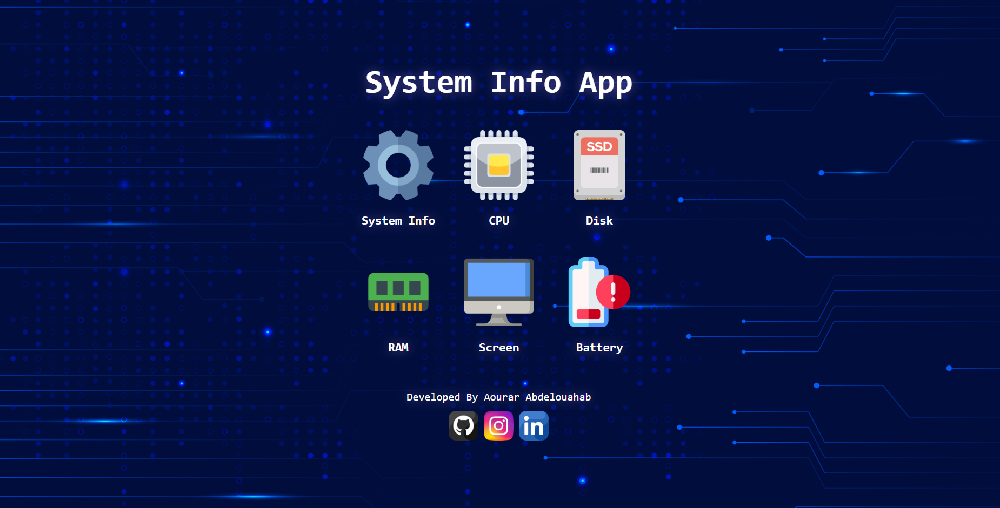

# 🔋 System Info Viewer

A cross-platform desktop application (only windows x64 executable in this repository) built to display detailed system information such as:

- 💻 **CPU** model, cores, logical processors  
- 🧠 **Memory** (RAM, swap)  
- 💾 **Disks** and partitions
- 💻 **System Info** Os version, kernel and more
- 🔋 **Battery** health, cycles, capacity, charge percentage  
- 🖥️ **Display** resolution, refresh rate, and more

## 👥 Collaboration

I’m open to collaboration on this project! 🚀  
If you’d like to:  
- Add new features (e.g., GPU info, more hardware details)  
- Improve UI/UX  
- Optimize Rust backend performance  
- Fix bugs  

👉 For collaboration or access to the **source code**, please contact me directly via **[email](mailto:abdelouahab.aourar@gmail.com)**.
